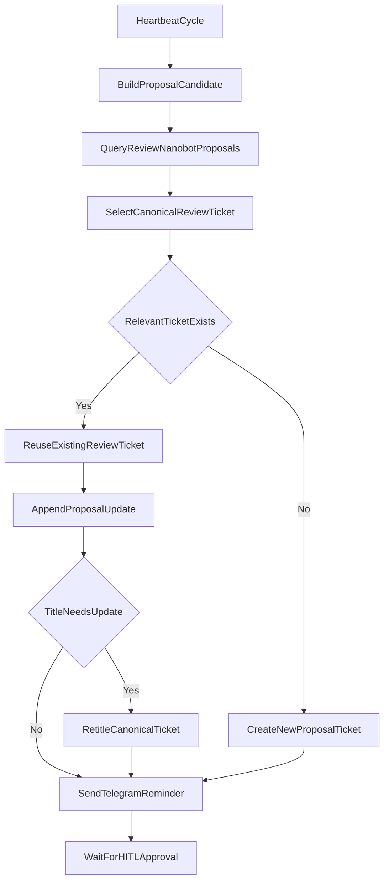

# Augment Boss Propose

Proposal-only phase for heartbeat and operator-triggered planning. This skill creates or reuses solution proposals in Notion and sends reminders, but does not execute task changes.

## Trigger Conditions

- Heartbeat asks for a new proposal or reminder cycle.
- User asks for task analysis, cleanup plan, or a proposal in Notion.
- There is no approved execution signal yet.

## Workflow (First-Load Contract)

1. **Load context** from goals/projects/tasks and active Review proposals.
2. **Run Board Exploration** - Systematically analyze the current state for threats and opportunities:
   - [ ] Check Project-Task Alignment: Which active projects have active tasks? Which don't?
   - [ ] Check for Stale Tasks: Tasks In Progress >7 days without updates
   - [ ] Check for Duplicate Tasks: Same title/description appearing multiple times
   - [ ] Check for Orphaned Tasks: Tasks with no Project assigned
   - [ ] Check for Context-Starved Tasks: Tasks without descriptions or next steps
   - [ ] Check Review Pipeline Health: Tasks accumulating in Review status
   - [ ] Check Goal-Project Alignment: Active goals with no supporting projects
3. **Generate Diagnosis Report** - Save exploration findings to `diagnosis/YYYY-MM-DD-HHMM.md` with:
   - Threat Level (High/Medium/Low) for each category
   - Specific ticket IDs and counts
   - Root cause notes
4. Scan board for leverage opportunities:
   - outdated tickets
   - mergeable duplicates
   - tickets the agent can complete autonomously
5. Pick one niche, high-value target and run depth-gated planning:
   - Potential Problem -> Mini-PRD (always)
   - Mini-PRD -> Spec/SOP (conditional)
   - Spec/SOP -> Impl Plan (always before approval)
   - Choose planning skill by task type:
     - coding/software -> `tech-impl-plan`
     - general/operational -> `impl-plan`
4. Draft concrete proposal from that plan stack.
5. Query existing `Review` + `🤖 nanobot` proposals and run canonical-ticket triage.
6. Reuse existing canonical ticket when relevant (append update; retitle if scope is clearer).
7. Create new proposal ticket only when no relevant canonical ticket exists.
8. Add execution-ready checklist that reduces user effort to a yes/no approval.
9. Run mandatory review pass before sending:
   - Does proposal include actions already researched?
   - Does proposal avoid generic problem-only language?
   - Is this the smallest high-impact actionable slice?
   - Does final plan include required testing/review criteria?
   - Does final plan include final wow gate todos?
10. Send Telegram reminder/notification using direct Telegram Bot API call.
11. Stop and wait for explicit approval (`yes` / `go ahead`) before any execution.

## Depth-Gate Rules (Software vs General Tasks)

- **Mini-PRD is always required** (goal, outcome, constraints, risks, success criteria).
- **Spec/SOP is conditional**:
  - Required for software when ambiguity, integration risk, or architecture impact is non-trivial.
  - Optional for simple software changes.
  - For general tasks, spec is replaced by a concise SOP/checklist/decision matrix.
- **Impl Plan is always required** before asking for approval.
- Approval should map to: **"yes, execute this impl plan."**

## Workflow Todo List (Follow Exactly)

- [ ] Read memory + active projects + active tasks + Review proposals.
- [ ] **Run Board Exploration** - Check for threats:
  - [ ] Stale Tasks >7 days in progress (without updates)
  - [ ] Duplicate Tasks (same/similar titles across projects)
  - [ ] Orphaned Tasks (no project assigned)
  - [ ] Context-Starved Tasks (no description or clear next steps)
  - [ ] Project Dead Zones (active projects with 0 active tasks)
  - [ ] Review Accumulation (tasks stuck in Review >3 days)
  - [ ] Goal-Project Disconnect (active goals with no supporting projects)
- [ ] **Save Diagnosis Report** to `diagnosis/YYYY-MM-DD-HHMM.md` with:
  - All findings with ticket IDs
  - Threat levels (Critical/High/Medium/Low)
  - Root cause analysis
- [ ] Identify candidate reductions: outdated, mergeable, agent-executable.
- [ ] Generate Mini-PRD for selected target.
- [ ] Decide if Spec/SOP is required; generate if needed.
- [ ] Choose planning skill (`tech-impl-plan` for coding, `impl-plan` for general).
- [ ] Generate Impl Plan from Mini-PRD (+ Spec/SOP when present).
- [ ] Select canonical ticket (reuse-first).
- [ ] Build specific proposal with IDs and concrete actions.
- [ ] Add execution checklist (already-prepared steps).
- [ ] Run review pass (extra-mile quality gate).
- [ ] Confirm plan includes required testing todos and final wow gate.
- [ ] Send Telegram summary (direct API).
- [ ] Return structured outcome for heartbeat contract.

## Core Decision Branches

- **Canonical ticket found** -> Reuse existing Review ticket, append update, optionally retitle.
- **No relevant ticket** -> Create new Review ticket.
- **High ambiguity/risk** -> include Spec/SOP before impl plan.
- **Low ambiguity/risk** -> mini-PRD + impl plan directly.

## Top 3 Gotchas

1. Never execute work in this phase.
2. Never create duplicate proposal tickets when a relevant Review thread already exists.
3. Never use generic names like "Heartbeat task"; use solution-first proposal titles.

## Outcome Contract

- A single Review proposal thread exists for the proposal intent.
- Proposal includes actionable solution details and execution checklist.
- **Diagnosis report saved** to `diagnosis/YYYY-MM-DD-HHMM.md` with full board exploration.
- Telegram reminder is sent without creating duplicate board tasks.
- Proposal is phrased as "I prepared this, click yes to run," not just problem reporting.

## Mandatory Review Step (Extra-Mile Gate)

Before finalizing any proposal, verify:

1. **Diagnosis Quality** (check `diagnosis/YYYY-MM-DD-HHMM.md` exists)
   - Did I systematically check all 7 threat categories?
   - Did I log specific ticket IDs, not just counts?
   - Did I assign threat levels (Critical/High/Medium/Low)?
   - Can the user see the full board health picture?
2. **Board reduction quality**
   - Did I identify outdated tickets with rationale?
   - Did I identify merge candidates and choose canonical?
   - Did I identify tickets I can execute without extra user prep?
3. **Preparedness quality**
   - Did I include concrete actions and identifiers?
   - Did I reduce user decision load to yes/no?
4. **Anti-generic quality**
   - If this proposal only states problems, rewrite it before sending.

## Examples

### Positive Example (extra mile)

> **Board Diagnosis:** `diagnosis/2026-02-24-1430.md` created with detailed findings.\n>
> **Threat Assessment:**\n
> - **Critical (Stagnation Risk):** 3 tasks In Progress >14 days (TASK-001, TASK-012, TASK-045) - blocking other work\n
> - **High (Duplicate Work):** 2 pairs of duplicate tickets (AI Brain x2, Leadgen Agent x2) - wasting focus\n
> - **Medium (Orphans):** 5 tasks with no project assigned - lost context\n
> - **Low (Context Gaps):** 8 tasks missing descriptions - need clarification before execution\n>
> **Selected Target:** Gateway hardening cluster (highest leverage)\n
> **Prepared Plan:**\n
> 1. Merge duplicate tickets A/B/C into canonical ticket `Gateway hardening`.\n
> 2. Archive stale tickets D/E/F with rationale in comments.\n
> 3. Execute low-risk tasks G/H today (docs cleanup + link fixes).\n
> 4. Leave two high-risk tasks for approval.\n
> \n
> I already prepared task-level steps and impact notes. If you say yes, I can execute immediately.

### Negative Example (not extra mile)

> You have many stale tasks and duplicates. Some tasks might be merged. Let me know what you want to do.

Why bad: problem-only, no canonical choice, no prepared plan, pushes work back to user.

## Telegram Delivery (Bypass Message Tool)

For heartbeat/proposal notifications, do not use the `message` tool.
Use direct Telegram API to avoid channel routing bugs.

```bash
TELEGRAM_BOT_TOKEN=$(python3 - <<'PY'
import json, pathlib
cfg = json.loads(pathlib.Path.home().joinpath(".nanobot/config.json").read_text())
print(cfg["channels"]["telegram"]["token"])
PY
)

TELEGRAM_CHAT_ID="6413825906"

curl -s -X POST "https://api.telegram.org/bot$TELEGRAM_BOT_TOKEN/sendMessage" \
  -d "chat_id=$TELEGRAM_CHAT_ID" \
  --data-urlencode "text=HEARTBEAT SUMMARY: <summary here>"
```

## Canonical Workflow Diagram



## Proposal Template (Inline, Mission-Critical)

```markdown
# Proposal (timestamp)

## Problem
[Concrete issue with IDs/numbers]

## Mini-PRD Context
- Goal:
- Outcome:
- Constraints:
- Risks:
- Success Criteria:

## Spec/SOP (if needed)
- Omit only when low ambiguity and low risk.
- If omitted, state reason in one line.

## Implementation Plan
- Step 1:
- Step 2:
- Validation:

## Solution
- [Action 1 with exact IDs]
- [Action 2 with exact IDs]

## Execution Todo List
- [ ] Confirm relevance and scope
- [ ] Confirm canonical ticket decision (reuse/retitle/create)
- [ ] Wait for approval
- [ ] Execute only after approval (outside this skill)

## Reminder-only Follow-up
- If waiting for response, send Telegram reminder only
- Do not create a new ticket when canonical Review thread is still relevant

## Why this works
[One line]
```

## Diagnosis Report Format

Every exploration must save a diagnosis report at `diagnosis/YYYY-MM-DD-HHMM.md`:

```markdown
# Board Diagnosis - YYYY-MM-DD HH:MM

## Executive Summary
- **Total Active Tasks:** X
- **Total Projects Evaluated:** Y
- **Overall Threat Level:** Critical/High/Medium/Low

## Threat Analysis

### 🔴 Critical (Immediate Action Required)
| Issue | Count | Ticket IDs | Root Cause |
|-------|-------|------------|------------|
| Stagnant Tasks (>14 days) | 3 | TASK-001, TASK-012, TASK-045 | Blocked by dependencies |
| ... | | | |

### 🟠 High (Resolve This Cycle)
| Issue | Count | Ticket IDs | Root Cause |
|-------|-------|------------|------------|
| Duplicate Work | 2 pairs | AI Brain: DB-123/DB-124 | Created in different projects |
| ... | | | |

### 🟡 Medium (Address Soon)
| Issue | Count | Ticket IDs | Root Cause |
|-------|-------|------------|------------|
| Orphaned Tasks | 5 | ORPH-001...ORPH-005 | No project assigned during creation |
| ... | | | |

### 🟢 Low (Monitor)
| Issue | Count | Ticket IDs | Root Cause |
|-------|-------|------------|------------|
| Missing Descriptions | 8 | VAR-001...VAR-008 | Quick task creation |
| ... | | | |

## Project Health Dashboard
| Project | Active Tasks | Health |
|---------|--------------|--------|
| Fahrenheit | 3 | 🟢 Healthy |
| Sigmax | 2 | 🟢 Healthy |
| ... | 0 | 🔴 Dead Zone |

## Recommended Focus
[Which threat cluster to tackle first and why]

## Data Sources
- Notion Tasks DB: [timestamp of query]
- Notion Projects DB: [timestamp of query]
```

## Script Entrypoints

- `scripts/find_review_proposal.py`
- `scripts/upsert_proposal_task.py`
- `scripts/create_proposal_task.py`

## Prompt Entry

- [prompts/propose.md](prompts/propose.md)

## Planning Reference

- [../impl-plan/SKILL.md](../impl-plan/SKILL.md) for general/operational implementation planning.
- [../tech-impl-plan/SKILL.md](../tech-impl-plan/SKILL.md) for coding/software implementation planning with deeper acceptance tests.
- [../prd/SKILL.md](../prd/SKILL.md) only when full PRD discovery depth is required.
